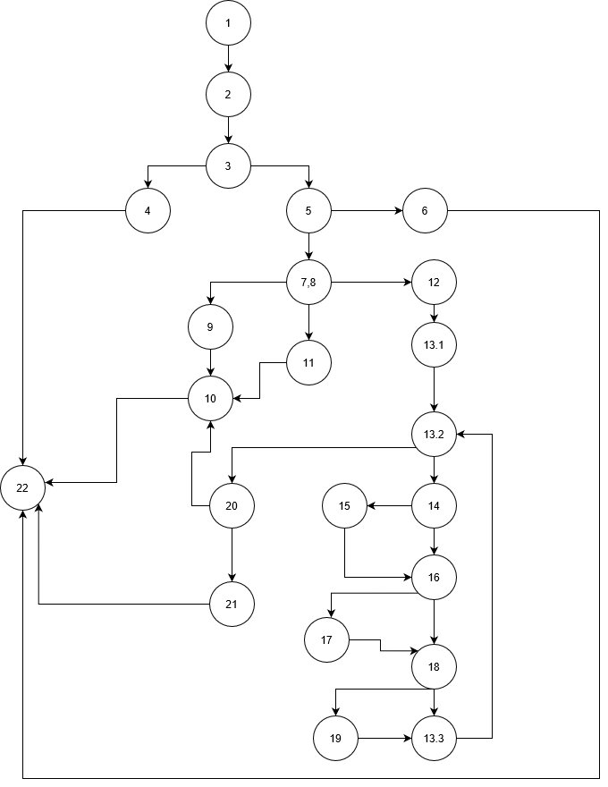
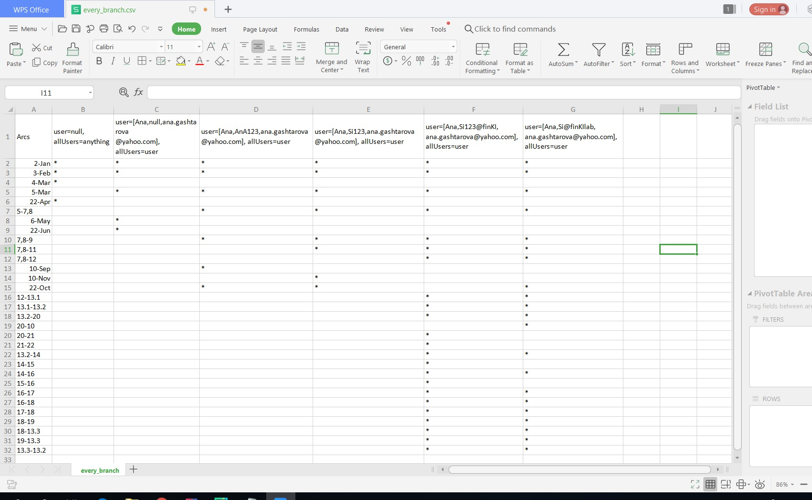
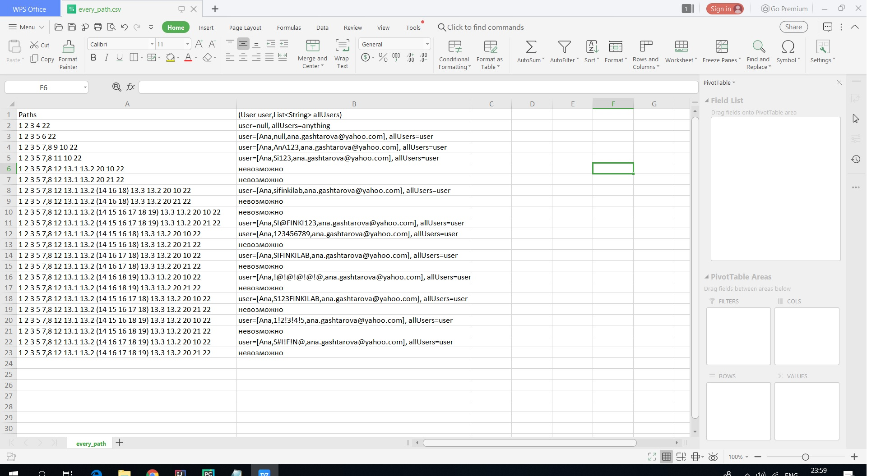

# Втора лабораториска вежба по Софтверско инженерство

## Ана Гаштарова, бр. на индекс 186001

**Група на код:**

Ја добив групата на код 3

**Control Flow Graph**

Control Flow Graph-от го нацртав во graph.io и го приложувам на сликата, а именувањето на јазлите го правам според броевите назначени пред линиите во кодот на функцијата function. (Кодот со нумерираните линиии можи да се види на si_lab2_so_broevi.txt датотеката во проектот)

**Цикломатска комплексност**

Цикломатска комплексност: број на ребра-број на јазли+2=31-23+2=10

**Тест случаи според критериумот Every branch**

Every branch критериумот ги вклучува сите гранки од еден јазол до друг во рамките на графот, и притоа јас искористив 6 тест случаи бидејќи два беа вклучени во различните RuntimeExceptions, 2 кои враќаат false ако должината на пасвордот е помала од 8 или го содржи корисничкото име, еден кој ги исполнува сите услови за добар пасворд и враќа true и уште еден кој не исполнува некој од условите како содржи цифра/голема буква/карактер при што не е соодветен пасворд и враќа false. 
1. user=null, allUsers=anything
2. user=[Ana,null,ana.gashtarova@yahoo.com], allUsers=user 
3. user=[Ana,AnA123,ana.gashtarova@yahoo.com], allUsers=user
4. user=[Ana,Si123,ana.gashtarova@yahoo.com], allUsers=user
5. user=[Ana,Si123@finKI,ana.gashtarova@yahoo.com], allUsers=user
6. user=[Ana,Si@finKIlab,ana.gashtarova@yahoo.com], allUsers=user

**Тест случаи според критериумот Every path**

Every path критериумот ги изминува патеките кои се генерираат во Control Flow графот. Соодветно на графот кој го претставив, ги наведувам сите патеки кои се можни и не се можни да се изминат и соодветните тест случаи, на сликата.

**Објаснување на напишаните unit tests**

Unit тестовите во рамките на проектот ги пишувам според тест случаите добиени од двата критериуми. Притоа, при run на тестовите добив дека тестовите поминуваат. 

